## Arrhythmia Detection App

The Arrhythmia Detection App provides real-time heart monitoring to detect arrhythmias. Users can create accounts and log in via Firebase, offering personalized functionality for both patients and doctors. The app leverages state management using Bloc and Provider for a smooth, scalable experience.

## Key features include

Arrhythmia Detection: Monitors heart rhythms and detects abnormalities in real-time.
Firebase Authentication: Allows users to create accounts and log in securely.
Doctor-Patient Chat: Enables patients to consult with doctors directly through the app.
Secure Payments: Facilitates payment for premium services and consultations.
State Management: Utilizes Bloc for efficient state management and Provider for managing app-level states.
Designed to provide both heart health monitoring and expert consultations, the app offers an all-in-one solution for managing arrhythmia-related concerns with scalable architecture and performance.

## App Screenshots

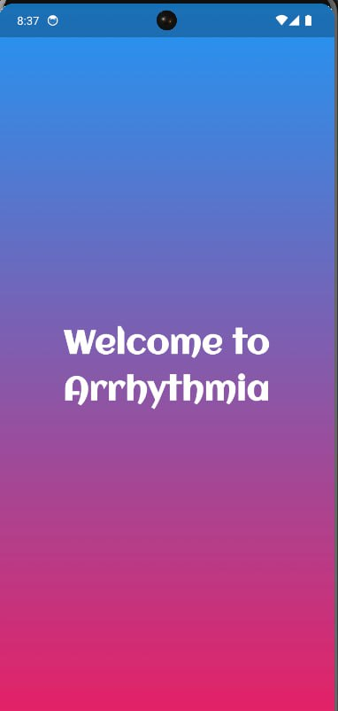
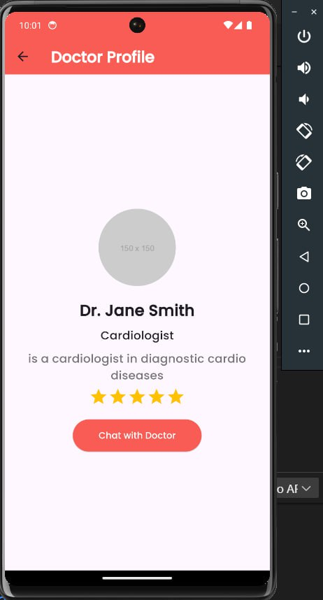
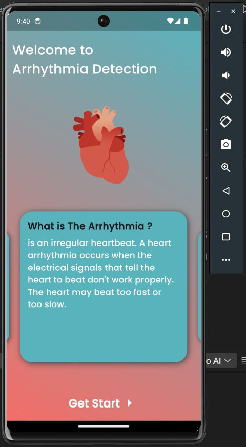
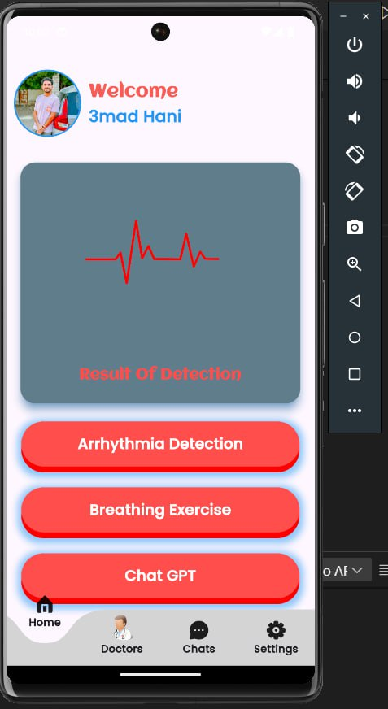
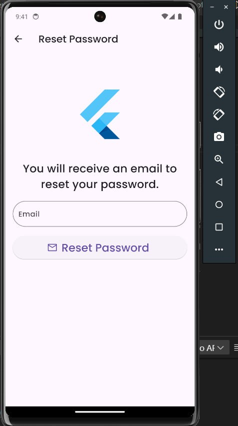
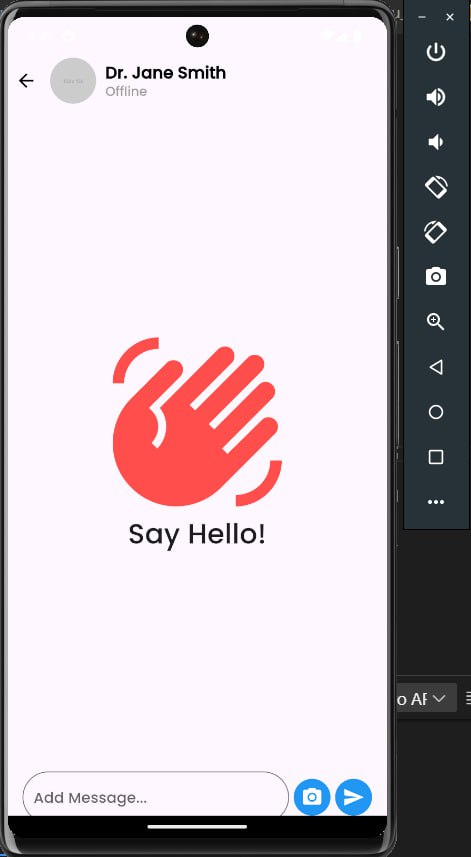
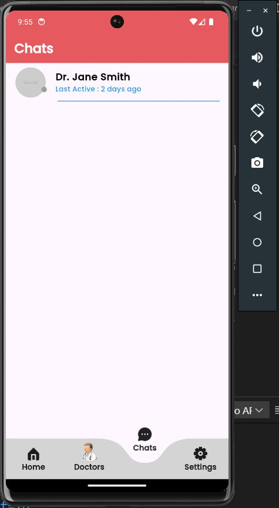
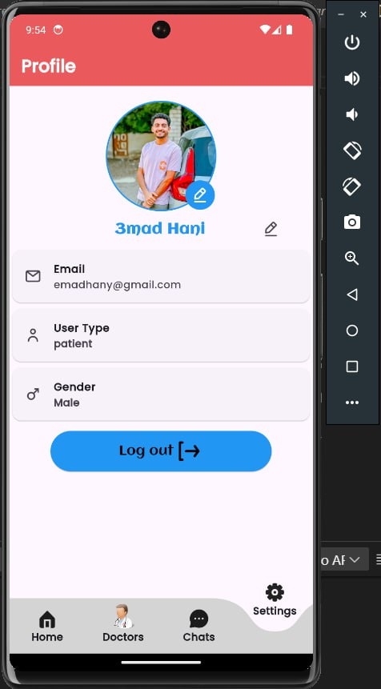
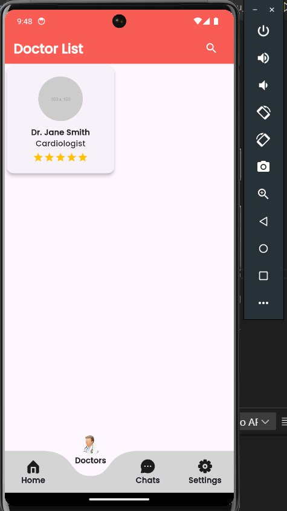
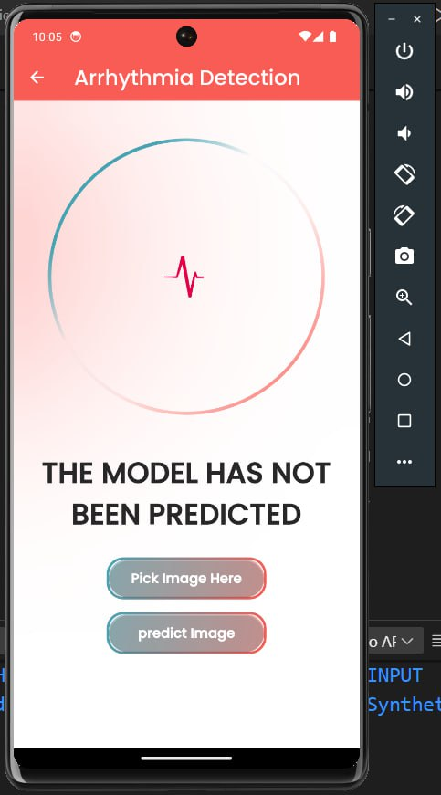
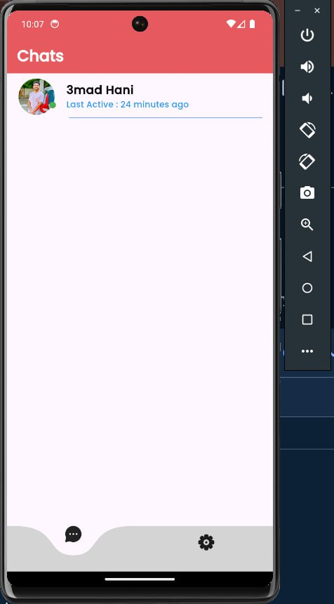
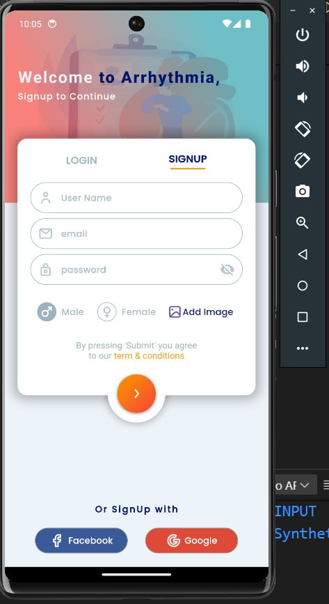
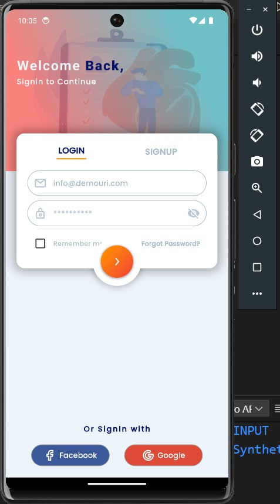
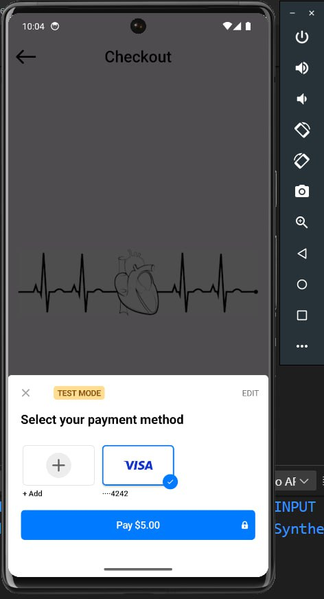
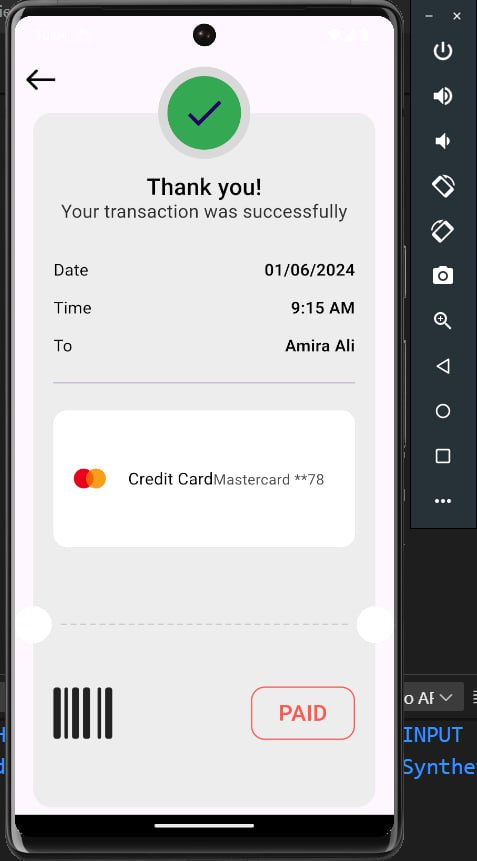
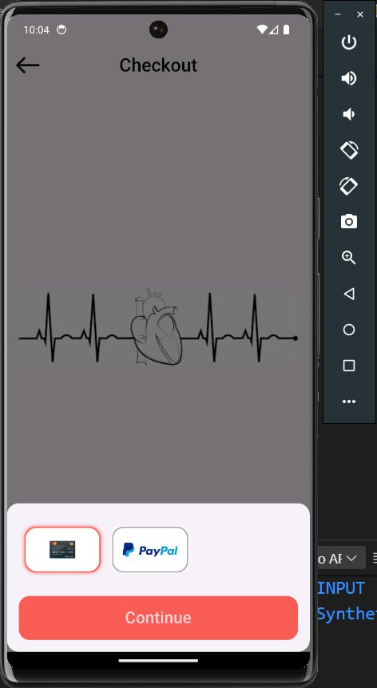
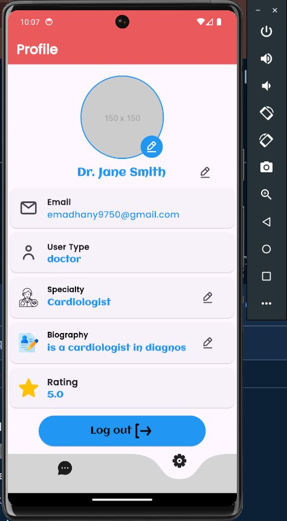
